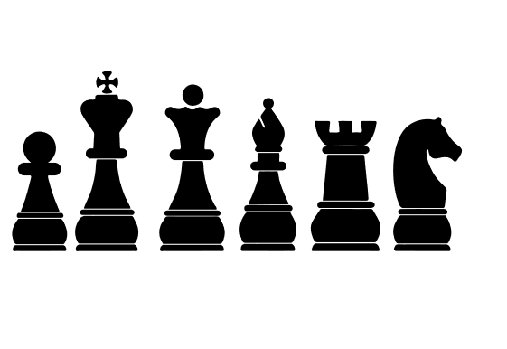

Task for this project: make 3D models of the chess pieces using the following sketch, given in .svg format

BONUS: Model the chess table, multiply and place the pieces on it and change the appearance of the whole project

This folder contains the Fusion 360 projects (the chess pieces and the chess table, separately), the .stl files for each piece and a screenshot of the Prusa Slicer window with the chess pieces.

