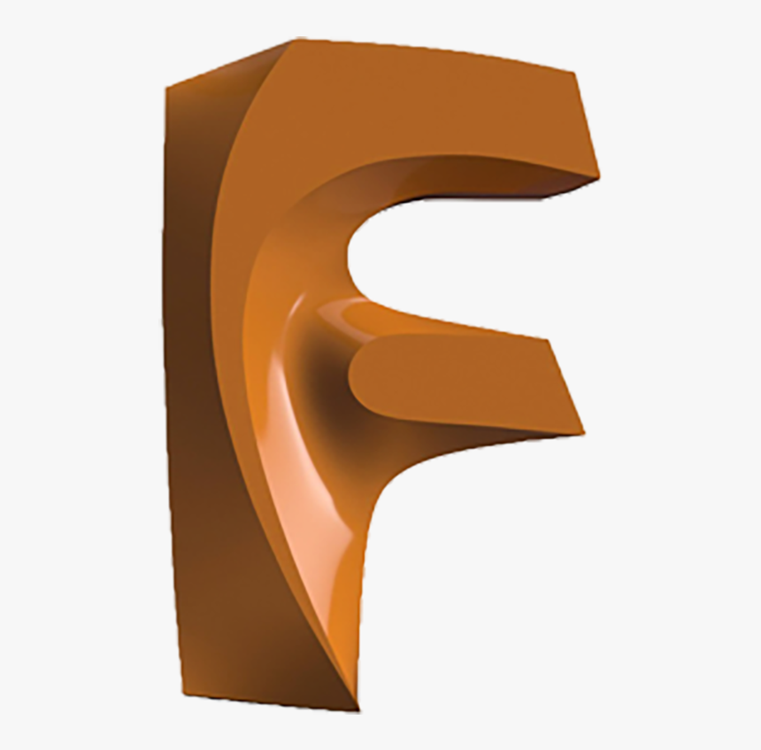
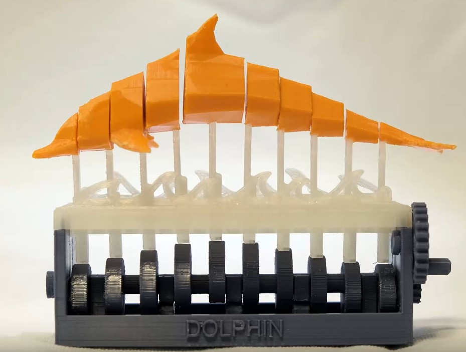
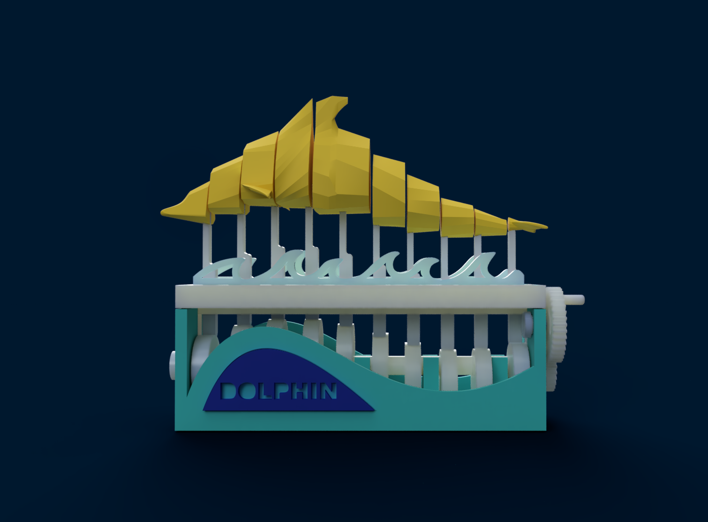
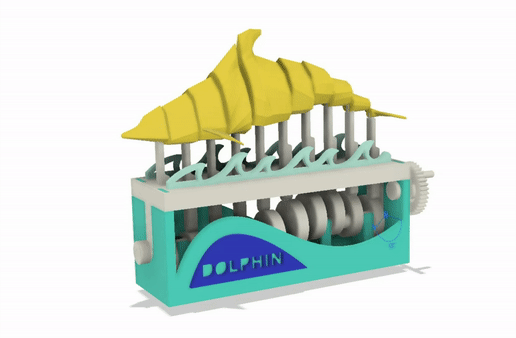
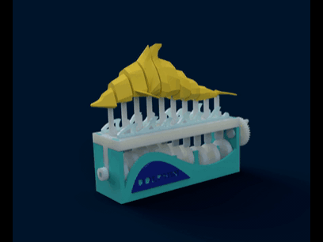

# The "Swimming Dolphin" Project

An amazing project for the 3D Modeling and Printing course! 

It was a real pleasure and an amazing challenge modeling this cute fat dolphin. 

## Short description

The mechanism is based on the rotation of the main crank, powered by a handle. This way, the crank pushes the pistons up, which go up and down alternatively. This creates the effect of the swimming dolphin.

## Motivation for choosing this model to design

I liked the idea of making a mechanism that creates the illusion of a swimming dolphin. Also, I thought it is a very nice challenge to model the dolphin, which is not the easiest thing to do as a newbie in 3D modeling.

Dolphins are really cute! So why not try model my own dolphin? :smiley: :dolphin:

## How it works

First of all, the handle must be powered with a rotation movement from the handle. This handle is connected to a gear, which powers another gear, giving the main crank the rotational movement in the opposite direction.

The crank is made of discs positioned at different heights on the main axis for the pistons to be also at different heights. The pistons should never be at the same height (at least not the neighbouring pistons), otherwise there will be no swimming effect.

This main crank, in its rotation, moves the pistons up and down (also using gravity for the pistons to come back down), which, of course, move the dolphin parts connected to them. And there it is! A nice fat swimming dolphin :)

For the technical part, the main joints used to make the dolphin swim are revolute joints on the handle, gears and crank and slider joints on the pistons (to slide through the upper case holes).

#### How the final product should look and work like:

  <kbd>
    
  </kbd>

## How to power the mechanism

The main joint that needs to be powered for the mechanism to work is the handle (big gear) revolute joint.

The easiest way to see the animation is by playing the only motion study in the project, selecting the "Play Loop" option.

## Software used

 The 3D modeling software I used is [Autodesk Fusion 360](https://www.autodesk.com/products/fusion-360/overview). It also has its own rendering option, so no additional software is needed for that. It's a really amazing software with a lot of features that let you model anything your imagination tells you!

 The slicer I use is the [Prusa Slicer](https://www.prusa3d.com/prusaslicer/), for the Prusa 3D Printers in our University's facilities.

## Files

The repository contains the .f3d file for Fusion 360 and .stl files for the preferred slicer to print the model.

It also contains extra images and gifs of the final product (the original model and my rendered model).

## Resources

To understand how the mechanism works in real life, I used [this video](https://www.youtube.com/watch?v=Ot3GTSwU0ZI&feature=youtu.be). The video also shows the steps into assembling the mechanism and how it works in the end.

Lots of help was provided by [this My Mini Factory post](https://www.myminifactory.com/object/3d-print-swimming-dolphin-99277), which contains all the .stl files needed, so I could analyze them much deeper and understand how I should actually model the pieces.

## Credits

Thanks to @woong (on [My Mini Factory](https://www.myminifactory.com/users/woong)) I could make this project possible.

You can also find him and more of his awesome projects on [youtube](https://www.youtube.com/channel/UCFsPo0HoJVGO5o4ItV1kCXA).

#### This is his final project:

  <kbd>
    
  </kbd>

## Final project

  <kbd>
    
  </kbd>

  <kbd>
    
  </kbd>
  <kbd>
    
  </kbd>

